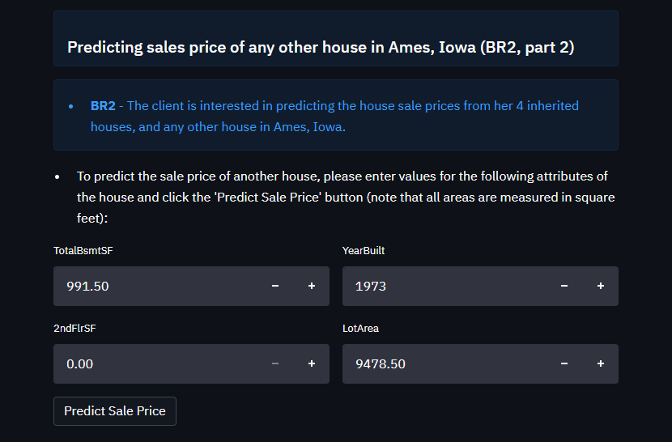

# Housing Price Predictor

Housing Price Predictor is a project developed to predict the sale price of houses in Ames, Iowa, USA, based on attributes of the houses.

This project has been created for the fifth portfolio project for Code Institute's Diploma in Full Stack Software Development, in the Predictive Analytics specialisation. The project is written in Python using Jupyter Notebooks with dashboard development using Streamlit, and is deployed with Heroku.

The project encompasses both data analysis and machine learning components. Through data analysis, it provides insights into the factors influencing housing prices, and quantifies their impact. The machine learning aspect allows users to input property information via the dashboard and receive a prediction of the expected sale price of that property.

The live application can be found [here](https://housing-price-predictor-0ed3160c5a8c.herokuapp.com/).

## Business Requirements

Our client has received an inheritance comprising four houses located in Ames, Iowa, USA. While she has a strong understanding of property prices in her home country of Belgium, she is uncertain about accurately estimating property values in the Iowan real estate market. She is concerned that her knowledge of what makes a house desirable and valuable in Belgium might not be applicable to Ames, Iowa.

The client's primary objective is to maximise the sales price for the inherited properties. She has found a public dataset with house prices for Ames, Iowa, and has provided this to us. She is also interested in predicting the sale price from any house in Ames, Iowa in case of future property ownership in that area.

As such, two business requirements have been agreed with the client:

* **BR1** The client is interested in discovering how the house attributes correlate with the sale price. Therefore, the client expects data visualisations of the correlated variables against the sale price to show that.
* **BR2** The client is interested in predicting the house sale price from her four inherited houses, and any other house in Ames, Iowa.

## Dataset Content
* The dataset for this project is sourced from [Kaggle](https://www.kaggle.com/codeinstitute/housing-prices-data). A fictitious user story was created, where predictive analytics can be applied as in a real project in the workplace. 
* The dataset has 1460 observations and represents housing records from Ames, Iowa, indicating house profile (Floor Area, Basement, Garage, Kitchen, Lot, Porch, Wood Deck, Year Built) and its respective sale price for houses built between 1872 and 2010.
* The variables contained in the dataset (both features and target) are described in the table below.

|Variable|Meaning|Units|
|:----|:----|:----|
|1stFlrSF|First Floor square feet|334 - 4692|
|2ndFlrSF|Second-floor square feet|0 - 2065|
|BedroomAbvGr|Bedrooms above grade (does NOT include basement bedrooms)|0 - 8|
|BsmtExposure|Refers to walkout or garden level walls|Gd: Good Exposure; Av: Average Exposure; Mn: Minimum Exposure; No: No Exposure; None: No Basement|
|BsmtFinType1|Rating of basement finished area|GLQ: Good Living Quarters; ALQ: Average Living Quarters; BLQ: Below Average Living Quarters; Rec: Average Rec Room; LwQ: Low Quality; Unf: Unfinshed; None: No Basement|
|BsmtFinSF1|Type 1 finished square feet|0 - 5644|
|BsmtUnfSF|Unfinished square feet of basement area|0 - 2336|
|TotalBsmtSF|Total square feet of basement area|0 - 6110|
|GarageArea|Size of garage in square feet|0 - 1418|
|GarageFinish|Interior finish of the garage|Fin: Finished; RFn: Rough Finished; Unf: Unfinished; None: No Garage|
|GarageYrBlt|Year garage was built|1900 - 2010|
|GrLivArea|Above grade (ground) living area square feet|334 - 5642|
|KitchenQual|Kitchen quality|Ex: Excellent; Gd: Good; TA: Typical/Average; Fa: Fair; Po: Poor|
|LotArea| Lot size in square feet|1300 - 215245|
|LotFrontage| Linear feet of street connected to property|21 - 313|
|MasVnrArea|Masonry veneer area in square feet|0 - 1600|
|EnclosedPorch|Enclosed porch area in square feet|0 - 286|
|OpenPorchSF|Open porch area in square feet|0 - 547|
|OverallCond|Rates the overall condition of the house|10: Very Excellent; 9: Excellent; 8: Very Good; 7: Good; 6: Above Average; 5: Average; 4: Below Average; 3: Fair; 2: Poor; 1: Very Poor|
|OverallQual|Rates the overall material and finish of the house|10: Very Excellent; 9: Excellent; 8: Very Good; 7: Good; 6: Above Average; 5: Average; 4: Below Average; 3: Fair; 2: Poor; 1: Very Poor|
|WoodDeckSF|Wood deck area in square feet|0 - 736|
|YearBuilt|Original construction date|1872 - 2010|
|YearRemodAdd|Remodel date (same as construction date if no remodelling or additions)|1950 - 2010|
|SalePrice|Sale Price|34900 - 755000|

## Project Terms and Jargon

- **Sale price** of a property is the current market price, in US dollars, of a property with various attributes.
- **Inherited property** is a property that the client has inherited, and wishes to sell for the maximum price achievable.
- Although not strictly "terms and jargon", we add a note here to remind users that all price data within this project are in US dollars and all areas are measured in square feet.

## Hypotheses and how we validated them

**Project hypotheses and their validation processes**

The following hypotheses were developed based on general knowledge of housing and of what features are likely to correlate with higher sale price of a property, in combination with the available features in the dataset (for example, we suspect that the precise location of a properly is likely to be highly relevant, but none of the features in the dataset provides detailed information regarding location, so this is not referenced in our hypotheses).
* The hypotheses relate to correlation. Note that they do not reference causation, since correlation in and of itself does not prove causation, although in this case it is highly likely that there is a causative relationship.
* The hypotheses were validated as follows:
    - Once the hypotheses had been clearly stated, the dataset needed to be examined for evidence of the hypothesised correlations.
    - The dataset was imported (notebook 1) and cleaned (notebook 2) in order for the data analysis to take place (notebook 3).
    - To examine our hypotheses, we then analysed Spearman and Pearson correlations between the different variables, as well as the Predictive Power Score ("PPS").
    - For ease of visualisation, these correlations were represented in heatmaps. For Spearman and Pearson correlations, a correlation threshold of 0.4 was set, and for Predictive Power Score a threshold of 0.2.
    - We then examined the heatmaps for evidence of correlation between the relevant variables. In each case, we were looking at the correlation coefficients between the features (input variables) and the target variable of `SalePrice`.
    - Since Spearman and Pearson correlations are widely recognised and understood, we looked for evidence to support our hypotheses here first. These provided at least adequate evidence to support the hypothesese in all cases; however, where there was a gap or where we felt that further supporting evidence might be valuable, we also looked to the PPS heatmap for any further information it might be able to provide.

**Hypothesis 1: The size of a house is positively correlated with its sale price**
* There are several variables that relate to the size of a house. Both Spearman and Pearson correlations show positive correlation betwen these variables and the sale price. For example, we see from our Spearman and Pearson heatmaps that:
    - `1stFlrSF` has a Spearman correlation coefficient of 0.58 and a Pearson correlation coefficient of 0.61 with `SalePrice`.
    - `GarageArea` has a Spearman correlation coefficient of 0.65 and a Pearson correlation coefficient of 0.62 with `SalePrice`.
    - `GrLivArea` has a Spearman correlation coefficient of 0.73 and a Pearson correlation coefficient of 0.71 with `SalePrice`.
    - Other variables relating to property size, such as `LotArea`, `MasVnrArea`, `OpenPorchSF` and `TotalBsmtSF` also show positive Spearman and / or Pearson correlation coefficients with `SalePrice`.
    - In combination, these findings provide solid validation of the hypothesis that larger houses tend to have higher sale prices.
    - We conclude that the size of a house is positively correlated with its sale price.

**Hypothesis 2: The quality of a house is positively correlated with its sale price**
* The variables that relate to the quality of a house are `OverallQual` and `KitchenQual`. We see from our Spearman and Pearson heatmaps that:
    - `OverallQual` has a Spearman correlation coefficient of 0.81 and a Pearson correlation coefficient of 0.79 with `SalePrice`.
    - `KitchenQual` does not have a high enough correlation coefficient with `SalePrice` to appear on our heatmaps, where the threshold for positive correlation is 0.4.
    - However, we see from the Power Predictive Score heatmap that both `OverallQual` and `KitchenQual` have reasonable correlations with `SalePrice` of 0.44 and 0.26 respectively.
    - If our hypothesis is true, we would in any case expect the overall quality of a house to have more correlation with its value than the quality of one room only. The correlation coefficients to `SalePrice` for both Spearman and Pearson correlations are strong. We can therefore also validate this hypothesis.
    - We conclude that the quality of a house is positively correlated with its sale price.

**Hypothesis 3: The year of construction of a house is positively correlated with its sale price (i.e., more recently constructed houses have higher sale prices)**
* The main variable relating to the age of a house is `YearBuilt`. We could also consider remodelling of a property (`YearRemodAdd`) and the year its garage was constructed (`GarageYrBlt`) to seek supporting evidence.
    - `YearBuilt` has a Spearman correlation coefficient of 0.65 and a Pearson correlation coefficient of 0.52 with `SalePrice`.
    - `YearRemodAdd` also shows correlation; it has a Spearman correlation coefficient of 0.57 and a Pearson correlation coefficient of 0.51 with `SalePrice`.
    - `GarageYrBlt` has a Spearman correlation coefficient of 0.63 with `SalePrice`, though we note that it does not meet our threshold of 0.4 for Pearson correlation.
    - Again, there is enough evidence to conclude that our hypothesis is correct.
    - We conclude that the year of construction of a house is positively correlated with its sale price.

## The rationale to map the business requirements to the Data Visualisations and ML tasks

* The two business requirements that have been agreed with the client are:

* **BR1:** The client is interested in discovering how the house attributes correlate with the sale price. Therefore, the client expects data visualisations of the correlated variables against the sale price to show that.
* **BR2:** The client is interested in predicting the house sale price from her four inherited houses, and any other house in Ames, Iowa.

Based on these business requirements and considering the potential needs of the various types of user, a number of Epics and User Stories have been developed. The Epics also map to the CRISP-DM (Cross Industry Standard Process for Data Mining) workflow shown below:

**Epic 1:** Business Understanding
* CRISP-DM step: Business Understanding

**Epic 2:** Information gathering and data collection
* CRISP-DM step: Data Understanding

**Epic 3:** Data visualisation, cleaning, and preparation
* CRISP-DM steps: Data Understanding, Data Preparation

**Epic 4:** Model training, optimisation and validation
* CRISP-DM steps: Modelling

**Epic 5:** Dashboard planning, designing, and development
* CRISP-DM steps: Business Understanding, Data Understanding (these steps relate to the planning and design of the dashboard); Deployment (relating to the development of the dashboard in preparation for deployment)

**Epic 6:** Dashboard deployment and release
* CRISP-DM step: Deployment

**User Stories:**

* User Stories relating to BR1 are addressed in the [data analysis notebook](https://github.com/frankiesanjana/housing-price-predictor/blob/main/jupyter_notebooks/03-data-analysis.ipynb) and are as follows:
    - **US1:** As any user, I want to know which attributes of a house are most correlated with its sale price so that I can base my predictions on the most appropriate features.
        - Task: produce heatmaps for Spearman and Pearson correlations and Power Predictive Score, and note which input variables are most highly correlated with the sale price.
    - **US2:** As any user, I want to see graphs showing the relationship between the relevant input variables and the target variable, so that I can understand the relationships between sale price and other features.
        - Task: produce appropriate graphs (scatter graphs for numerical variables, violin plots for categorical variables and line graphs for time series variables) to illustrate the relationships between the relevant input variables and the target.
    - **US3:** As any user, I want to understand the project hypotheses and how they were validated, so that I can better understand the determinants of a property's sale price.
        - Task: interpret the data from the heatmaps described above and highlight how these data confirm the project hypotheses.

* User Stories relating to BR2 are addressed in the [modelling and evaluation notebook](https://github.com/frankiesanjana/housing-price-predictor/blob/main/jupyter_notebooks/05-modelling-evaluation.ipynb) and the dashboard, and are as follows:
    - **US4:** As the client, I want to be able to reliably predict the sale price of the houses I have inherited, so that I can sell them for the greatest possible price.
        - Task: conduct regression analysis using machine learning so that the sale price can be predicted from the most relevant features (note: regression analysis is a supervised ML task that is used to predict the value of the label from a set of related features)
        - Note: if the model's performance using regression analysis is poor, this could be changed to a classification problem: another supervised ML task, but where the category of a house's sale price is predicted rather than a value. Categories in this case could be in a format such as "up to and including price A", "between price A and price B", "equal to or greater than price B".
    - **US5:** As any user, I want to have interactive input widgets in my dashboard, so that I can provide new data relating to features of a house and obtain a prediction of its likely sale price.
        - Task: Develop a dashboard that provides the appropriate interface for the user to interact with the data and obtain a price prediction based on newly obtained information.
    - **US6:** As any user, I want to be able to access the pipelines that were used in the model, so that these can be used with new data and allow me to predict the sale price of houses that were not in the original dataset.
        - Task: Develop functionality that provides the pipelines and technology to the dashboard that enables the price prediction to function correctly based on new data that the user inputs.
    - **US7:** As a technical user, I want to understand the ML steps that were used to predict the sale price, so that I can understand the model that was used.
        - Task: Present clear information relating to the ML development process.
    - **US8:** As a technical user, I want to know the technical details relating to model performance, so that I can understand how reliable the predictions are.
        - Task: Note the model evaluation metrics and display the regression evaluation plots relating to train and test sets.

* User Stories relating to both BRs are addressed in the dashboard, and are as follows:
    - **US9:** As the client, I want to be able to access a dashboard that is easy to interpret and use, so that I can easily view the results of the analysis and modelling.
        - Task: Provide a dashboard to the client and ensure that it is clear and easy to use, with any necessary instructions provided to the user.
    - **US10:** As any user, I want the dashboard to be available online, so that it is readily accessible for all users.
        - Task: Deploy the dashboard to a web server or hosting platform such as Heroku for convenient access through a web browser.
    - **US11:** As any user, I want to understand the dataset that was used in the analysis and the model training, so that I understand the dataset and the quality and limitations of the analysis and modelling.
        - Task: Provide a clear description of the dataset in the dashboard.

## Machine Learning Business Case

* A Machine Learning model will be trained in order to meet the second business requirement (BR2).

* The aim behind the predictive analytics task performed by the Machine Learning model is to predict the sale price in US dollars of properties in Ames, Iowa, USA.
    - The model should allow our client to predict the sale price of four houses that she has inherited.
    - It should also allow prediction of the sale price of other houses with similar attributes.

* The learning method for the ML model is linear regression: since we are predicting a value that is a continuous variable, using a number of predictor variables, the most appropriate ML task is linear regression (a supervised ML task).
    - The sale price is the target variable, i.e., the variable that we are interested in predicting.

* Our ideal outcome is to develop a model that will provide reliable predictions of the sale price of a house based on its known attributes.

* The model success metrics are:
    - **The model should achieve an R2 score of at least 0.75 on both train and test set.**
        - R2 is a statistical measure that describes the proportion of variance in the data that is explained by the model.
        - That is, it shows how well a regression model predicts the outcome of observed data.
        - Values range from 0 to 1.
        - As such, a R2 value of 0.75 means that the model provides a good, but not perfect, prediction of the target variable (sale price) based on the input variables.
    - The model will be considered to have failed if it does not achieve an R2 score of at least 0.75. In this case, other modelling techniques could be considered to try and develop a model that achieves a satisfactory performance.
    - We will also evaluate the mean absolute error, mean squared error and the root mean squared error.
        - However, these are not used separately to evaluate the model performance and are presented here for information only.

* The output is defined as a continuous value for sale price in US dollars.
    - Since the client wishes to find the total sale price for four inherited houses, we will present the summed predicted sale price for the four houses. However, this will not be included in the live prediction of the model, since the user will enter data for one house at a time.
    - For live prediction of sale price of a house other than the four inherited houses, the user can enter the values of the relevant features and obtain a prediction of the sale price in real time.
    - Both the summed sale price and the live prediction are relevant for our client, who already has four inherited houses but anticipates a potential future requirement to predict the sale price of other similar houses from Ames, Iowa.

* Heuristics in general are problem-solving techniques that provide quick and approximate solutions when traditional, more complex methods might be slow or impractical.
    - Heuristics can also serve as preprocessing steps for more advanced machine learning models. For example, they can help in identifying relevant features or patterns that can be used in the development of a predictive model.
    - In this case, our client might base her first approximation of a house's sale price on the sale price of nearby houses that she observes with similar attributes.
    - We also note that she has a good understanding of property prices in her home country of Belgium. As a first approximation, then, she might expect that properties that would achieve high sale prices in Belgium would also achieve high sale prices in Ames, Iowa.
    - This type of analysis would allow the client to produce a rough estimate of the value of her properties.
    - However, she is interested in maximising the sale price for the properties, and as such would like a more detailed analysis, in order to provide a more accurate and reliable estimate of the likely sale price of the properties.
    - We therefore proceed with the development of a machine learning model.

* The training data are a public dataset with house prices for Ames, Iowa, that our client has found via an online search.
    - The dataset contains 1460 observations and 22 features.
    - We do not have information about the recency or reliability of these data, and we note that there are some missing values in the dataset, which have been handled in the [data cleaning notebook](https://github.com/frankiesanjana/housing-price-predictor/blob/main/jupyter_notebooks/02-data-cleaning.ipynb)
    - Ideally we would check whether the dataset is recent or not before proceeding, since house prices can fluctuate significantly over time, and would prefer a dataset whose reliability has been verified and which has no missing values. However, here we can simply note this as a possible limitation of our dataset, and hence of our model and its predictions.

## Dashboard Design

* Sidebar for navigation
* The sidebar is used for navigation around the dashboard:

* Project Summary
    - Introduces project and describes its functionality
    - Lists project terms and jargon
    - Describes and links to the dataset
    - Links to the project README
    - Lists the two business requirements for the project, and informs the reader that each of these has been successfully met
* Project Summary page:

* House Sale Price Study
    - House Price Correlation Study (BR1)
    - Notes the business requirement answered by the correlation study
    - Allows inspection of dataset (via checkbox)
    - Notes the features with the highest correlation to sale price
    - Introduces the heatmaps and explains why they were used
    - Shows Spearman and Pearson correlation and PPS score heatmaps (via checkbox)
    - Summarises findings and provides text to help the reader interpret the plots that follow
    - Shows histogram of target variable `SalePrice` (via checkbox)
    - Shows plots of correlation between each variable and `SalePrice` (via checkbox)
        - violin plot for categorical
        - scatterplot for numerical
        - line graphs for time series
* House Sale Price Study page:

* House Sale Price Predictor
    - Housing Price Predictor (BR2)
    - Notes the business requirement answered by the house price predictor
    - Shows the raw dataset for the four inherited houses 
    - Shows the four inherited houses' attributes and their predicted sale prices
    - Displays the summed predicted price for the four inherited houses
    - Contains interactive input widgets to allow the user to input data from further houses to predict the sale price
    - Displays a button to allow the user to predict the sale price of a house with the details they have added using the ML pipelines developed during the project
    - When the user enters acceptable feature values into the input widgets and presses the button, displays the predicted price for the property based on the values the user has entered
* House Sale Price Predictor page: top:

* House Sale Price Predictor page: interactive widgets for user input:

* Project Hypotheses and Validation
    - Lists the project hypotheses and summarises the project findings and hypothesis validation
* Project Hypotheses and Validation page:

* ML: Housing Price Prediction
    - Summarises the aims, development process and findings of the ML process
    - Displays the ML pipeline to predict house sale price
    - Displays the features that the model was trained on and their importance in a bar chart
    - Displays the pipeline performance metrics: R2 score, MAE, MSE, RMSE, for each of the train and test sets
    - Displays regression evaluation plots showing the predicted and actual sale prices on train and test sets
* ML: Housing Price Prediction page:

## Fixed Bugs
During testing of the deployed dashboard, the following error message was encountered on the House Sale Price Predictor page:

This was because different values used in creating the widgets had different number formats from one another.
* This was addressed by converting all numbers to floats in the input widgets, except for the widget for `YearBuilt` where all numbers have been converted to integers.
    - Converting the number type to integer rather than float for `YearBuilt` was necessary to prevent users from inputting non-integer values for the build year of a house (for example, we do not want to allow 1973.5 as an input, only 1973 or 1974).
* Once this had been done the page functioned as intended.

## Unfixed Bugs
To the best of my knowledge, there are no unfixed bugs in the project.

## Testing

Testing was carried out in a number of ways:

* Continuous testing of Jupyter Notebooks as they were developed: in practice, this means that the notebooks have all been run multiple times.
    - Errors were generally related to missing imports and were simple to correct.
    - The notebooks have all been run in their entirety as a final check.
    - Note that the cells can take some time to run successfully, particularly in the modelling notebook, "Notebook 05 - Modelling & Evaluation".

* Streamlit dashboard testing locally
    - The dashboard was tested continuously by running the local server during its development.
    - Each time a new dashboard section or piece of functionality was created, I ran the server in order to test whether it functioned as intended, using the command `streamlit run app.py` in the terminal.
    - Where a checkbox was added to the dashboard, I verified that selecting and deselecting the checkbox displayed and hid the relevant content as appropriate.
    - I ran the price predictor a number of times with different inputs, in order to verify that the input widgets worked as intended and the sale price was predicted correctly.
    - No bugs or errors were discovered during this phase of testing.

* Streamlit dashboard testing of the deployed dashboard
    - The steps undertaken above to test the dashboard when it was running locally were repeated on the deployed app in Heroku.
    - Notably, the bug described above in the "Fixed Bugs" section did not appear when the dashboard was run locally, so there are a number of commits relating to testing and fixing this bug.

* User testing
    - User testing has been undertaken for two main reasons:
        - To ensure that a new user can understand the dashboard's purpose and functionality
        - To ensure that a user cannot cause errors in the widgets' functionality by typing in non-numerical values, or otherwise "break" the dashboard

* Results from user testing to understand the dashboard's functionality
    - It was generally felt during user testing that the dashboard was self-explanatory and clear.
    - However, the absence of units and chart titles was noted, and it was felt that it might be helpful to add a note to remind users that variables such as `LotArea`, where the units are not specified, are in square feet.
    - As it happens, this is particularly relevant, since our client is in Belgium, where areas would always be given in square metres rather than square feet.

* Results from user testing to ensure that user input or use of the dashboard cannot cause errors
    - It was noted during user testing that unlike most non-numerical characters, the parentheses () and the letter 'e' do appear on screen when typed into the widgets.
    - I initially wondered whether this might be to allow reference to [Euler's number](https://en.wikipedia.org/wiki/E_(mathematical_constant)); however, searching online confirms that it is to allow the use of e as an exponent; see [this Stack Overflow thread](https://stackoverflow.com/questions/31706611/why-does-the-html-input-with-type-number-allow-the-letter-e-to-be-entered-in).
    - For this usage, the inputs function correctly. For example, in the Stack Overflow thread referenced above, an example is given as follows: "using the e is useful for condensing large numbers that would be otherwise tedious to type out. As a trivial example, 2e2 = 2*10^2 = 200"
        - Typing `2e2` into the input widgets causes this functionality to work as intended for the inputs where it is in range (`TotalBsmtSF` and `2ndFlrSF`): when the user then clicks out of the widget or presses Enter the numerical value in the widget changes to read 200 as intended.
        - The `e` notation also functions identically to other numbers if a value outside the range of the input widgets is entered. For example, typing `2e2` into the `LotArea` causes the warning message to display, because the minimum value for this widget is 260 and the value of 2e2 = 2*10^2 = 200, which is less than 260.
        - For values entered using the e notation that are outside the range, and for any other numerical value that is entered outside this range, as soon as the user presses Enter or clicks anywhere outside the widget, including clicking on the 'Predict Sale Price' button, widgets containing any of these characters are returned to their default values.
        - We therefore concluded that this functionality is working as intended, and no further action needs to be taken.

* Validator testing
    - Python files were run through the [CI Python Linter](https://pep8ci.herokuapp.com/).
    - Although no major errors were discovered, there were several "line too long" notifications, as well as some spacing and whitespace issues.
    - As an example, the linter results from the file `multipage.py` are shown below before and after tidying:

## Deployment
### App Deployment with Heroku

* The App live link is: https://housing-price-predictor-0ed3160c5a8c.herokuapp.com/
* Set the runtime.txt Python version to a [Heroku-20](https://devcenter.heroku.com/articles/python-support#supported-runtimes) stack currently supported version.
* The project was deployed to Heroku using the following steps:

1. Log in to Heroku and create an App
* Sign up / log in to [Heroku](https://www.heroku.com/)
* Create a new app from the Heroku dashboard:

* Choose a unique name for your app and select your region, then click "Create app":

2. At the Deploy tab, select GitHub as the deployment method
* The Deploy tab can be selected from the tab options that appear along the top of the page:

* In Heroku, in the Deploy tab:
    - Select "Connect to GitHub" from the deployment methods section
    - Search for the name of the GitHub repository to connect to
    - Click Connect
    - Your Heroku app should now be connected to your GitHub account:

3. Select your repository name and click Search. Once it is found, click Connect.
4. Further down the Deploy tab, you have the option to choose to Enable Automatic Deploys or, if you would prefer to deploy manually, select Deploy Branch.
* Note that if you deploy manually, you will need to re-deploy each time the repository is updated.
* Note that if you deploy automatically, it is not uncommon to receive a notification that automatic deployment has failed. For this project, this has so far always been successfully fixed by going to Heroku and manually redeploying.

5. The deployment process should happen smoothly if all deployment files are fully functional. Click the button Open App on the top of the page to access your App.
6. If the slug size is too large then add large files not required for the app to the .slugignore file.

Note that during deployment on Heroku, the following warning message was displayed in the build log: `Warning: Your slug size (418 MB) exceeds our soft limit (300 MB) which may affect boot time.` However, loading times for the dashboard have consistently appeared to be acceptable during testing, so no further action has been taken on this point. 

## Forking this repository
It is possible to copy the repository in order to experiment with your own changes without affecting the original project. The steps to do this as as follows:

* Navigate to the GitHub website.
* Log in if necessary.
* Navigate to the repository that you want to fork - the repo for this project is Bake It Better.
* In the top right-hand corner of the page, click on "fork".
* You will be taken to a page to create your own fork. You can edit the project name and add a description (optional).
* Click on "create fork" to complete the process.

## Cloning this repository
It is also possible to copy the repository onto your own local machine. In practice, this might be done to make it easier to fix merge conflicts, add or remove files, and push larger commits. To do this, follow these steps:

* Navigate to the GitHub website.
* Log in if necessary.
* Navigate to the repository that you want to clone - the repo for this project is Bake It Better.
* Above the list of files, find the "Code" button and click on it:

* To clone the repository using HTTPS, under "Clone with HTTPS", click the clipboard icon. To clone the repository using an SSH key, including a certificate issued by your organization's SSH certificate authority, click Use SSH, then click the clipboard icon. To clone a repository using GitHub CLI, click Use GitHub CLI, then click the clipboard icon.
* Open your computer terminal.
* Change the current working directory to the location where you want the cloned directory.
* Type "git clone" and then paste the location that you have copied.
* Press "enter" and your local clone will be created.

## Technologies, Libraries and Packages

### Technologies
* GitHub was used to create the project's repository and store the project's files
* VS Code was used to create and edit the project's files
* Within VS Code, Jupyter was used to create the notebooks for data collection, cleaning, and analysis, feature engineering, and training and evaluation of the ML model
* Streamlit was used to create the dashboard
* Heroku was used to deploy the project
* Kaggle was used to source the dataset for this project, and provide an API token to allow it to be imported

### Libraries and Packages

* ydata_profiling was used to inspect each variable in the dataset to better understand the data 
* NumPy was used for basic mathematical operations such as calculation of standard deviations and mean values, as well as to generate arrays of random numbers such as the mask of zeros used in the correlation heatmaps
* Pandas was used for tasks including:
    - Operations involving CSV files (loading existing CSV files and saving datasets to new CSV files)
    - Creating and modifying series and dataframes
* Matplotlib was used for constructing plots to visualise the data analyses
* Seaborn augments the functionalties of matplotlib and was used to create the heatmaps and regression evaluation plots

* Feature Engine was used for a number of machine learning tasks:
    - One Hot Encoding and OrdinalEncoder were used to encode categorical variables for correlation analyses and modelling respectively
    - The LogTransformer, Yeo-Johnson and power transformers were used to transform the data in order to make it more normally distributed
    - SmartCorrelatedSelection was used to identify and remove correlated features from the dataset before modelling took place

* SciKit Learn was also used for several machine learning tasks and operations:

    - Importing the majority of the algorithms used to train the model
    - Pipeline function for building machine learning pipelines
    - SelectFromModel for creating feature selection steps in the pipelines
    - StandardScaler for scaling data to prepare it for modelling
    - Train-Test Split for splitting the train and test sets
    - R2 score, mean squared error and mean absolute error for model evaluation

* XGBoost provided the XGBoost Regressor algorithm

* SciPy was used for the Shapiro-Wilk test for normal distribution

* Predictive Power Score was used for conducting a Predictive Power Score analysis

## Credits 

### Code

* I have used Code Institute's [Churnometer walkthrough project](https://github.com/Code-Institute-Solutions/churnometer) for guidance on project approach and structure, as well as copying and adapting sections of the code in several places.
    - Where code from the project has been used, this is also noted either as a comment in the code or, within the Jupyter notebooks, in the accompanying Markdown commentary.

### Machine Learning Resources, Knowledge and Understanding

* Frequent and extensive reference has also been made to Code Institute's learning materials for the Predictive Analytics specialisation, since this is the learning framework that has equipped me with the vast majority of the knowledge that I have put into building the project.
* In particular, within the materials for this Predictive Analytics specialisation, I have used the Scikit-Learn section, unit 6, which gives suggested values to use as a starting point for hyperparameter optimisation
    - Additional resources have been used to select further values to test in hyperparameter optimisation, in particular the [Scikit-Learn documentation for Random Forest Regressor](https://scikit-learn.org/stable/modules/generated/sklearn.ensemble.RandomForestRegressor.html), as well as the following Towards Data Science articles by Will Koehrsen on Hyperparameter Tuning the Random Forest in Python:
        - [Part 1](https://towardsdatascience.com/improving-random-forest-in-python-part-1-893916666cd)
        - [Part 2](https://towardsdatascience.com/hyperparameter-tuning-the-random-forest-in-python-using-scikit-learn-28d2aa77dd74)
* I have also made reference to various articles on [Machine Learning Mastery](https://machinelearningmastery.com/), [Towards Data Science](https://towardsdatascience.com/) and [Codecademy](https://www.codecademy.com/) to improve and reinforce my understanding of the concepts learned in this specialisation and hence to create this project.

### Content 

* The dataset used in this project is stored on [Kaggle](https://www.kaggle.com/codeinstitute/housing-prices-data).

### Acknowledgements

* Thank you to my mentor, Mo Shami, for project guidance and review.
